# Polyglot Codebase Knowledge Graph

> Generated offline by **readmenator**. Supports C, C++, Python, Go, Rust, JS/TS, Java, C#, Shell, PHP, Dart, GDScript, Nim, ASM.
> No LLMs. No tokens. Pure static analysis. See more [here](https://github.com/grisuno/ReadMenator) 

**Total Files Parsed:** 1 | **Total Symbols Extracted:** 62 | **Total Imports:** 11

## Structural Knowledge Map

```mermaid
graph TD
    classDef mod fill:#1e1e1e,stroke:#ff6666,stroke-width:2px,color:#fff;
    classDef cls fill:#2d2d2d,stroke:#4ec9b0,stroke-width:2px,color:#fff;
    classDef fn fill:#333,stroke:#dcdcaa,stroke-width:1px,color:#dcdcaa;
    classDef ext fill:#111,stroke:#666,stroke-dasharray: 5 5,color:#aaa;
    readmenator_py["readmenator.py (py)"]
    class readmenator_py mod;
    readmenator_py_Config["Config"]
    class readmenator_py_Config cls;
    readmenator_py --> readmenator_py_Config
    readmenator_py_Symbol["Symbol"]
    class readmenator_py_Symbol cls;
    readmenator_py --> readmenator_py_Symbol
    readmenator_py_Node["Node"]
    class readmenator_py_Node cls;
    readmenator_py --> readmenator_py_Node
    readmenator_py_Edge["Edge"]
    class readmenator_py_Edge cls;
    readmenator_py --> readmenator_py_Edge
    readmenator_py_LanguageParser["LanguageParser"]
    class readmenator_py_LanguageParser cls;
    readmenator_py --> readmenator_py_LanguageParser
    ext___future__["__future__"]
    class ext___future__ ext;
    readmenator_py -.->|imports| ext___future__
    ext_ast["ast"]
    class ext_ast ext;
    readmenator_py -.->|imports| ext_ast
    ext_os["os"]
    class ext_os ext;
    readmenator_py -.->|imports| ext_os
    ext_re["re"]
    class ext_re ext;
    readmenator_py -.->|imports| ext_re
    ext_sys["sys"]
    class ext_sys ext;
    readmenator_py -.->|imports| ext_sys
    ext_unittest["unittest"]
    class ext_unittest ext;
    readmenator_py -.->|imports| ext_unittest
    ext_warnings["warnings"]
    class ext_warnings ext;
    readmenator_py -.->|imports| ext_warnings
    ext_dataclasses["dataclasses"]
    class ext_dataclasses ext;
    readmenator_py -.->|imports| ext_dataclasses
    ext_pathlib["pathlib"]
    class ext_pathlib ext;
    readmenator_py -.->|imports| ext_pathlib
    ext_typing["typing"]
    class ext_typing ext;
    readmenator_py -.->|imports| ext_typing
    ext_shutil["shutil"]
    class ext_shutil ext;
    readmenator_py -.->|imports| ext_shutil
```

---

## Architecture Reference

### PY (1 files)

#### `readmenator.py`
**Path:** `readmenator.py`

**Classs:**
- `Config` (line 27) - *Centralized, immutable configuration. No magic numbers or hardcoded paths.*
- `Symbol` (line 50) - *Represents a code symbol (function, class, struct, etc.).*
- `Node` (line 60) - *Represents a file/module in the codebase knowledge graph.*
- `Edge` (line 71) - *Represents a relationship between two nodes.*
- `LanguageParser` (line 78) - *Base class for language-specific parsers (Strategy Pattern).*
- `CParser` (line 137) - *Parser for C and C++ files.*
- `PythonParser` (line 183) - *Parser for Python files using the native ast module for 100% accuracy.*
- `GoParser` (line 219) - *Parser for Go files.*
- `RustParser` (line 247) - *Parser for Rust files.*
- `JavaScriptParser` (line 284) - *Parser for JavaScript and TypeScript files.*
- `JavaParser` (line 315) - *Parser for Java files.*
- `CSharpParser` (line 341) - *Parser for C# files.*
- `ShellParser` (line 367) - *Parser for Shell/Bash/Zsh files.*
- `PHPParser` (line 385) - *Parser for PHP files.*
- `DartParser` (line 408) - *Parser for Dart/Flutter files.*
- `GDScriptParser` (line 433) - *Parser for Godot GDScript files.*
- `NimParser` (line 449) - *Parser for Nim files.*
- `AssemblyParser` (line 472) - *Parser for Assembly files (.asm, .s).*
- `ParserFactory` (line 485) - *Factory to instantiate the correct parser based on file extension.*
- `PolyglotScanner` (line 515) - *Securely walks directory trees and orchestrates polyglot AST/Regex analysis.*
- `MermaidRenderer` (line 601) - *Converts graph primitives into Mermaid diagram syntax.*
- `DocumentationGenerator` (line 690) - *Generates comprehensive Markdown documentation.*
- `readmenatorApplication` (line 765) - *Main application orchestrator.*
- `TestPolyglotreadmenator` (line 786) - *Comprehensive test suite validating polyglot contracts.*

**Functions:**
- `__init__` (line 81) - *Initialize parser with filename and configuration.*
- `parse` (line 89) - *Parse the file content and extract symbols and imports.*
- `_extract_specifics` (line 94) - *Override in subclasses to implement language-specific extraction.*
- `_extract_docstring` (line 98) - *Extract documentation comment preceding a symbol.*
- `_extract_specifics` (line 140) - *Extract C/C++ specific symbols and imports.*
- `_extract_specifics` (line 186) - *Extract Python specific symbols and imports with warning suppression.*
- `_extract_specifics` (line 222) - *Extract Go specific symbols and imports.*
- `_extract_specifics` (line 250) - *Extract Rust specific symbols and imports.*
- `_extract_specifics` (line 287) - *Extract JS/TS specific symbols and imports.*
- `_extract_specifics` (line 318) - *Extract Java specific symbols and imports.*
- `_extract_specifics` (line 344) - *Extract C# specific symbols and imports.*
- `_extract_specifics` (line 370) - *Extract Shell specific symbols.*
- `_extract_specifics` (line 388) - *Extract PHP specific symbols and imports.*
- `_extract_specifics` (line 411) - *Extract Dart specific symbols and imports.*
- `_extract_specifics` (line 436) - *Extract GDScript specific symbols and imports.*
- `_extract_specifics` (line 452) - *Extract Nim specific symbols and imports.*
- `_extract_specifics` (line 475) - *Extract Assembly specific symbols.*
- `get_parser` (line 507) - *Return the appropriate parser instance for the given file extension.*
- `__init__` (line 518) - *Initialize scanner with configuration.*
- `_is_ignored` (line 522) - *Check if path contains ignored directories.*
- `_validate_path_security` (line 526) - *Validate path is safe to process.*
- `_check_directory_depth` (line 539) - *Ensure directory depth doesn't exceed limit.*
- `scan` (line 547) - *Scan codebase and return nodes and edges.*
- `__init__` (line 604) - *Initialize renderer with configuration.*
- `_sanitize_id` (line 608) - *Sanitize node ID for Mermaid compatibility.*
- `render` (line 615) - *Render complete Mermaid graph with intelligent pruning.*
- `__init__` (line 693) - *Initialize generator with configuration.*
- `generate` (line 698) - *Generate complete knowledge base document.*
- `__init__` (line 768) - *Initialize application with optional configuration.*
- `run` (line 774) - *Execute documentation generation.*
- `setUp` (line 789) - *Set up test fixtures.*
- `tearDown` (line 795) - *Tear down test fixtures.*
- `_write_fixture` (line 801) - *Write test fixture to disk.*
- `test_c_parser` (line 807) - *Validate C parser extraction logic.*
- `test_env_and_vendor_dirs_ignored` (line 826) - *BDD: Given vendor/env dirs, When scanned, Then they are ignored.*
- `test_syntax_warnings_suppressed` (line 842) - *Security: Invalid escape sequences in Python strings must not emit warnings.*
- `test_mermaid_graph_truncation` (line 854) - *Resilience: Mermaid renderer prunes graph if node limit is exceeded.*
- `test_polyglot_integration` (line 865) - *Validate full polyglot integration.*
